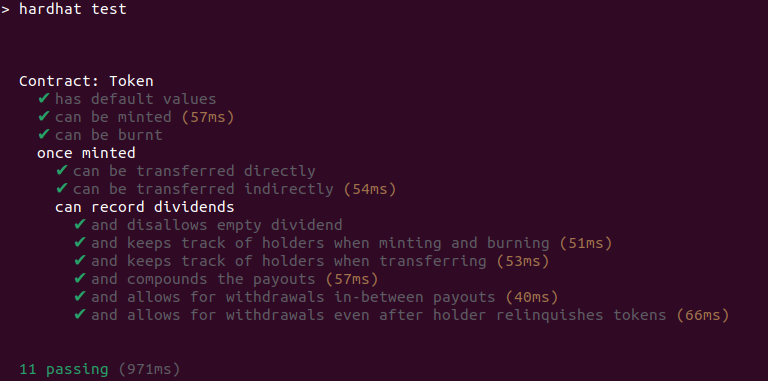

# Tech interview smart contracts coding problem

This is a Solidity coding problem for tech interviews. It is designed to take **no more than a few hours**.

## Getting setup

Ensure you have installed:

- [Node.js](https://nodejs.org/) **v20+**
- [Hardhat](https://hardhat.org/) (already included as a dev dependency)

## Instructions

### 1. Setup

Clone the repo locally and install the NPM dependencies using npm:

### 2. Task

**You only need to write code in the `Token.sol` file. Please ensure all the unit tests pass to successfully complete this part.**

The contracts consist of a mintable ERC-20 `Token` (which is similar to a _Wrapped ETH_ token). Callers mint tokens by depositing ETH. They can then burn their token balance to get the equivalent amount of deposited ETH back.

In addition, token holders can receive dividend payments in ETH in proportion to their token balance relative to the total supply. Dividends are assigned by looping through the list of holders.

Dividend payments are assigned to token holders' addresses. This means that even if a token holder were to send their tokens to somebody else later on or burn their tokens, they would still be entitled to the dividends they accrued whilst they were holding the tokens. 

You will thus need to **efficiently** keep track of individual token holder addresses in order to assign dividend payouts to holders with minimal gas cost.

For a clearer understanding of how the code is supposed to work please refer to the tests in the `test` folder.

Your Solution must pass the test: `npm run test` - run the tests (Hardhat)

### 3: Submission

Record a short [Loom video](https://www.loom.com) showing how it works, including the expected and actual behavior if you're testing.

### 4. Deadline

Please complete and submit the result within 24 hours unless otherwise discussed.

## Implementation Summary

The `Token.sol` contract has been fully implemented to satisfy the requirements and pass the complete Hardhat test suite (`11 passing`).

### What was implemented

- Full ERC-20 core behavior required by the tests:
  - `approve`, `allowance`, `transfer`, and `transferFrom`.
- Minting and burning flow:
  - `mint()` mints tokens 1:1 with deposited ETH.
  - `burn(dest)` burns the caller's full token balance and sends the equivalent ETH to `dest`.
- Dividend accounting:
  - `recordDividend()` distributes incoming ETH proportionally to current token balances.
  - `getWithdrawableDividend()` returns each account's accrued but unclaimed dividend.
  - `withdrawDividend(dest)` transfers the caller's accrued dividend and resets their withdrawable amount.
- Efficient token-holder tracking:
  - Active holders are tracked with an array plus index mapping.
  - Holder removal uses swap-and-pop to keep updates O(1).
  - Holder list is updated on mint, burn, and transfer balance changes.

### Why this design

- **Correctness with test expectations:** Every required behavior in `test/token.test.js` is covered, including transfer rules, allowance handling, proportional dividend compounding, and withdrawal after token relinquishment.
- **Gas-aware holder maintenance:** The array + index mapping + swap-and-pop pattern avoids costly array shifts and keeps holder management simple and efficient.
- **Clear state separation:** Token balances, allowances, holder membership, and withdrawable dividends are maintained independently, reducing coupling and making behavior easier to reason about and maintain.